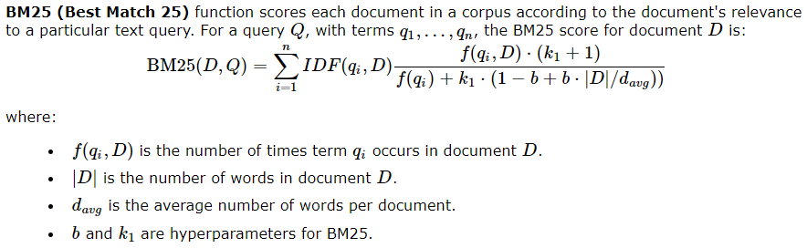
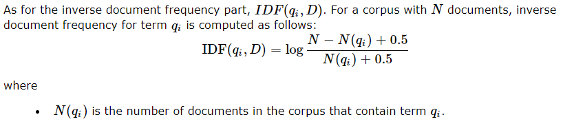
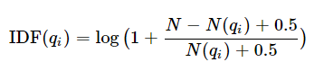

# CSCE-470-Project

## Hosted on Heroku
[Link](https://csce-470-project-2022.herokuapp.com/)

## How to run FLASK webapp
1. Ensure you're in `~/CSCE-470-Project`
1. Create a python virtual environment with `python3 -m venv venv`
1. Enter the python virtual environment with `. venv/Scripts/activate` or `. venv/bin/activate`
1. Install the required python modules with `pip install -r requirements.txt`
1. Start the FLASK server with `python app.py`
1. Exit the python virtual environment with `deactivate`

## How to setup the environment to execute the code
1. Clone this repository
2. In your terminal, navigate to within this repository's folder. (e.g. with `cd ~/CSCE-470-Project`)
3. Execute the command `python3 python/test.py`. It will prompt you to enter a query statement that will be searched within our songs collection (data/azlyrics-csv).

## BM25 Equation
The following is the core algorithm that we decided to follow in order to implement docment ranking amongs our song collection.

### IDF Equation

### IDF Equation (Accounts for negatives)
This IDF equation accounts for negative IDFs by adding 1 to all IDFs. \

